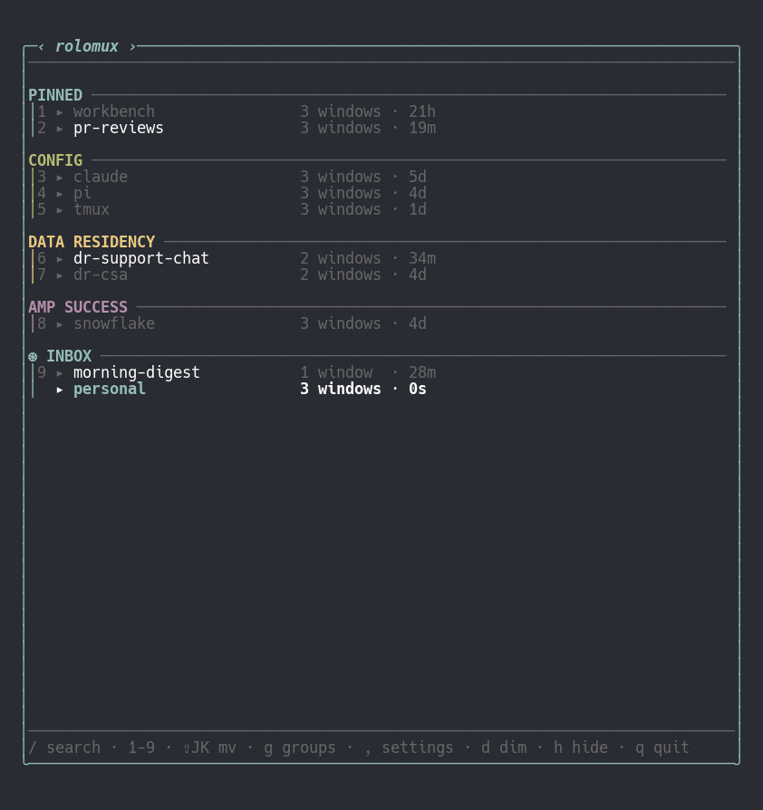
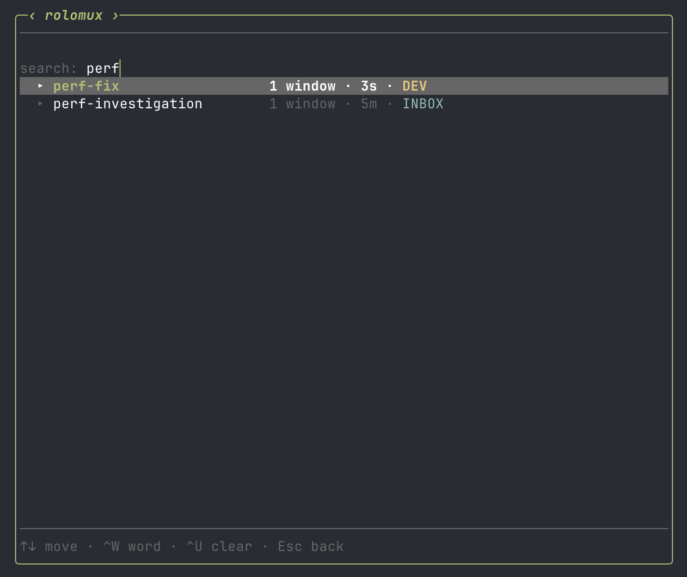

# rolomux


-lightgrey)


A slick tmux session picker that sorts your sessions into color-coded groups to bring you terminal zen.

A tidy workshop is easier to work in. Give every session a home, keep active projects front and center, and leave the rest waiting quietly.

It's useful from the moment you launch it but easily shapes to your workflow.



## Install

```sh
brew install jeffdt/tap/rolomux
```

Then add a keybind to `~/.tmux.conf` to pop it open:

```tmux
bind s display-popup -E -B -w 84 -h 60% "exec rolomux"
```

Reload tmux and press `prefix + s`.

You can use other popup dimensions, but these work well to start. `-h` also accepts a fixed line count (e.g. `-h 30`) instead of a percentage.

## Quick start
1. Press `prefix + s` to open rolomux. All of your sessions start out in a group called `INBOX`.
2. Move a few sessions around with `⇧J` and `⇧K`.
3. Press `g` to open Group Management.
4. Press `n` to create a new group. Call it `PROJECTS`, then press `Esc` to return to the picker.
5. Move a session into `PROJECTS` with `⇧J` and `⇧K`.
6. Try creating a few more groups, reordering the groups themselves, and changing their colors.

New sessions arrive in INBOX. Over time, you sort, group, and reorder them until your workspace feels the way you want it to.

## How it works

- **Create your groups.** Press `g` to jump into group management mode, where you can create, rename and color code your groups.
- **Sort your sessions.** Move your sessions between groups with `⇧J`/`⇧K`. Once sorted, they stay there, in that order.
  New sessions collect in an inbox until you're ready to sort them.
  Groups and their ordering persist across tmux restarts, and they stick around until you delete them.
- **Expandable trees.** Each session can be expanded to peek at the list of windows inside it or jump straight to a specific window.
- **Lightweight.** One tmux query per launch. No hooks or background processes keeping track of your sessions while you work.
- **Fuzzy search built in.** Press `/` to filter sessions by name. If this is your preferred way of working, tweak the settings to always launch in search mode.
- **Dim sessions, then focus past them.** Press `d` to mark a session dormant; it stays in place but renders in a dimmed state to indicate that it's on the back burner. Press `f` to enter focus mode, hiding dormant sessions and any group left with nothing visible in it; press `f` again to show everything. Dormant sessions are still fully usable when shown, and focus mode helps you understand your workspace at a glance.
- **Tune the colors.** Press `,` to open Settings and tune the color of the application border, palette used for group headers, and more. Uses your terminal's ANSI colors to ensure it harmonizes with your existing terminal themes.

**Note:** rolomux depends on (and promotes) good tmux hygiene.
Get in the habit of naming your sessions and windows so you can make sense of them later.
You can reinforce this habit with your binds for creating sessions and windows, immediately prompting you for the name at creation time:
```tmux
bind c new-window -c "#{pane_current_path}" \; command-prompt -I "" "rename-window '%%'"
bind C new-session \; command-prompt -I "" "rename-session '%%'" \; command-prompt -I "" "rename-window '%%'"
```

## Keys

| Key | Action |
| --- | --- |
| `↵` | Switch to the selected session/window and close |
| `1`-`9`, `0` | Switch to session 1-10 immediately (`0` = the 10th) |
| `M-1`-`M-9`, `M-0` | Switch to session 11-20 immediately (Option/Alt; `M-1` = 11th ... `M-0` = 20th) |
| `j` / `k` | Move the cursor, wrapping between the top and bottom (also `↓` / `↑`) |
| `l` / `→` | Expand a session's window tree |
| `←` | Collapse a session's window tree |
| `z` | Expand or collapse window trees for all sessions |
| `⇧J` / `⇧K` | Move the selected session or window up/down (also `⇧↓` / `⇧↑`): a session row reorders within its group or crosses into the neighboring group; a window row reorders within its session or crosses into the neighboring session. Both wrap around at the top/bottom of the list. |
| `R` | Rename the selected session or window |
| `g` | Open group-management mode |
| `,` | Open settings |
| `d` | Toggle dormant (dim) on the selected session |
| `f` | Toggle focus mode (hide dormant sessions and empty groups) |
| `/` | Enter search mode (type to filter, `↵` switch, `Esc` back) |
| `q` / `Esc` | Quit |

`M-` is Meta (Option on macOS).
Your terminal must send Option as Meta: in Ghostty set `macos-option-as-alt = true` (iTerm2: "Left Option key → Esc+"; Terminal.app: "Use Option as Meta key").
On Linux it is automatic.

When a session is at the top of its group, `⇧K` jumps it up to the group above it; when it's at the bottom, `⇧J` drops it into the group below it. The same idea applies one level down: expand a session and put the cursor on a window, and `⇧J`/`⇧K` reorders that window within its session, crossing into the neighboring session's last/first slot at the edge. Moving a session's very last window would destroy that session, so rolomux only ever does that automatically when it's provably safe (no attached client, or one that tmux will gracefully switch elsewhere via `detach-on-destroy off`); otherwise it asks you to press the same key again to confirm, or -- if confirming would eject someone's attached client -- quietly leaves a placeholder window behind instead of destroying the session at all.

### Groups

Press `g` to open group-management mode, a full-screen view of your current groups.
Once inside:

| Key | Action |
| --- | --- |
| `j` / `k` | Navigate between groups, wrapping between the first and last group (also `↓` / `↑`) |
| `↵` / `r` | Rename the selected group |
| `n` | Create a new group and name it |
| `d` | Delete the selected group (its sessions fall back to the inbox group) |
| `c` | Cycle the selected group's header color |
| `⇧J` / `⇧K` | Reorder the selected group down / up (also `⇧↓` / `⇧↑`) |
| `Esc` / `q` / `g` | Back to the picker |

As you create groups, they'll be assigned a color from your terminal theme (cyan, green, yellow, magenta, blue, red); new groups rotate through them, `c` flips a group's color, and empty groups show grayed out until you fill them.

### Search



Press `/` to enter search mode.
Type any part of a session name; results are ranked best-match-first, with the top result auto-selected as you type.
`Enter` switches to the highlighted session; `Esc` returns to command mode with the cursor left on the match.
Move within results with `↑`/`↓` (or `Ctrl-n`/`Ctrl-p`, `Ctrl-j`/`Ctrl-k`), wrapping between the first and last match.
`Backspace` deletes the last character, `Ctrl-W` (or `Option/Alt` + `Backspace`) deletes the last word, and `Ctrl-U` clears the query.

While searching, section headers and jump numbers (sessions 1-20) are hidden; the list is flat and collapsed.
If focus mode is on, search results exclude dormant sessions, and the footer shows how many are currently hidden.

### Dormant sessions and focus mode

Press `d` to mark the selected session dormant.
It will render in a dimmed state as a visual cue of your paused work.
Dormant sessions are still fully usable, and by default they also get assigned jump numbers.
In Settings, change **Number dormant sessions** to **No** if you want dormant sessions to be skipped when jump numbers are assigned.

Once you have a few sessions marked dormant, you can press `f` to enter focus mode.
In focus mode, both dormant sessions and empty groups disappear from view altogether.
This is a powerful tool when you cannot afford distractions luring you away from your priorities.
You will see a small reminder like `8 sessions hidden` while focus mode is active.

Dormant sessions and focus mode persist across popups until turned off.
Press `f` again to exit focus mode and everything will be restored exactly as it was.
Press `d` again on a dormant session to mark it active again.

Think of this as one more tool in your kit to help you tend your sessions and retain focus.

### Settings

Press `,` to open Settings, a full-screen view of picker-wide preferences, grouped into two sections. A description of the currently selected setting is always shown at the bottom.

**Behavior**

- **Default mode.** Whether the picker opens in Command mode or straight into Search.
- **Number dormant sessions.** Whether visible dormant sessions are included in jump numbering (sessions 1-20).
- **Remember expanded sessions.** Off by default (every popup starts fully collapsed). When on, expanding or collapsing a session's window tree (`l`/`h`/`z`) persists across popups, so the sessions you're actively jumping between stay expanded.
- **Clear dormant on attach.** Off by default. When on, attaching to a dormant session automatically clears its dormant flag, so you don't have to remember to press `d` yourself.
- **New group position.** Where a newly created group is inserted: **Top** of the list, or **Bottom** (default), immediately above the inbox, which always stays last.
- **Session metadata.** Whether the row's trailing timestamp shows time since last activity (**Recency**, default), time since the session was created (**Age**), or is omitted entirely (**Hidden**).

**Appearance**

- **Attached session color.** The color used to highlight the session your tmux client is currently attached to.
- **Border color.** rolomux's own border frame color.
- **New group color.** How a newly created group picks its header color: Rotate through the palette in order, pick a Random color each time, or always use one Static color.
- **Color palette.** Which of the 16 colors from your terminal theme are in the rotation for new group headers.

| Key | Action |
| --- | --- |
| `j` / `k` | Move between rows, wrapping between the first and last row (also `↓` / `↑`) |
| `h` / `l` | Cycle a value / expand-collapse a color picker (also `←` / `→`) |
| `Space` / `Enter` | Toggle or activate the selected row |
| `c` | Cycle the selected color row |
| `Esc` / `q` / `,` | Back to the picker |

## Configuration

Groups, session state, and settings persist to `~/.config/rolomux/config.toml`. You normally don't edit this by hand; rolomux updates it automatically as you work.

**Note:** rolomux tracks each session by its tmux session id in this file, so renaming a session won't lose any of its rolomux state.

## Motivation

Agent-driven development has stretched our expectations on parallelism/multitasking to the extreme, and the biggest challenge is now context switching and staying organized.
And while there are brand new tools popping up every day to launch and manage agents, tmux is an extremely mature, stable, and full-featured app that solved parallelism decades ago.
It just lacks a few key qualities for keeping things organized.
It isn't going to become vaporware, it's not going to have weird bugs that nobody catches because the userbase is too small, and its APIs are stable and easy for an agent to manipulate.
It makes more sense to solve that organization gap than to throw it away and build some new tool altogether.

## Design philosophy

I want this tool to be fun to use, nice to look at, unobtrusive, and low-commitment.
It places a high value on aesthetics but remembers it is a productivity tool first and foremost.
It doesn't hook into your tmux session and watch for sessions being created or destroyed; it relies on live data available at the time it's invoked.
It stores everything in a simple TOML file you could hand-edit if you desire, but should never have to.
It's minimalist and clean in presentation and prefers to spend its complexity on customization.
As a tool intended to be used all day every day, it should aim for zero friction.
If a workflow takes two keystrokes instead of one, there would ideally be a setting that makes it one keystroke, for the people that plan to invoke that workflow every time they launch it.
It favors your existing terminal palette over complete color customization to ensure it always feels like a "native" tool and not something bolted on later.
Any new features must make the tool easier or more fun to use.
Bloat is an enemy that must be actively kept at bay.

## Disclaimer

This project was fully vibe coded. Use at your own risk.

## License

MIT
